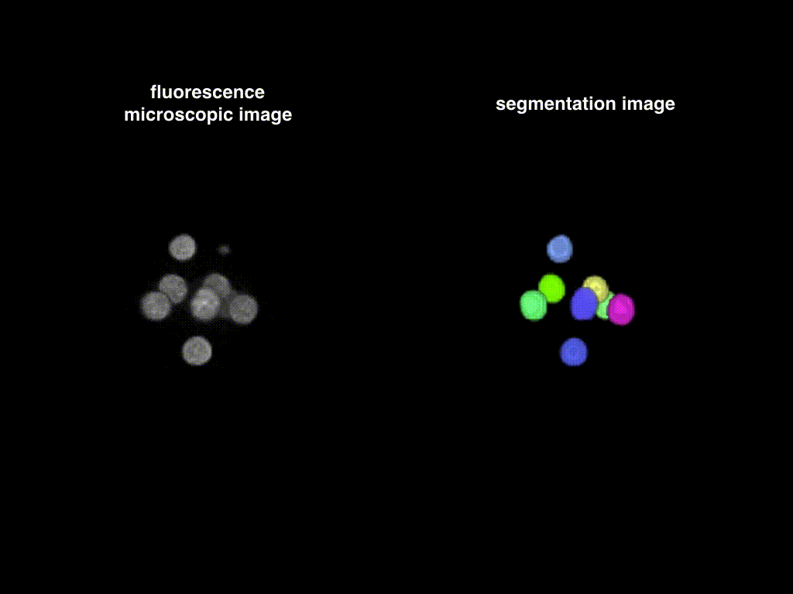

# QCA Net: Quantitative Criterion Acquisition Network

This is the code for [Convolutional Neural Network-Based Instance Segmentation Algorithm to Acquire Quantitative Criteria of Early Mouse Development](https://doi.org/10.1101/324186).
This project is carried out in cooperation with [Funahashi lab at Keio University](https://fun.bio.keio.ac.jp/) and three labs: Hiroi lab at Sanyo-onoda City University, [Kobayashi lab at the University of Tokyo](http://research.crmind.net/), and Yamagata lab at Kindai University.


## Overview

Quantitative Criterion Acquisition Network (QCA Net) performs instance segmentation of 3D fluorescence microscopic images.
QCA Net consists of Nuclear Segmentation Network (NSN) that learned nuclear segmentation task and Nuclear Detection Network (NDN) that learned nuclear identification task.
QCA Net performs instance segmentation of the time-series 3D fluorescence microscopic images at each time point, and the quantitative criteria for mouse development are extracted from the acquired time-series segmentation image.
The detailed information on this program is described in our manuscript posted on [bioRxiv](https://doi.org/10.1101/324186).


## Performance

The result of instance segmentation of time-series 3D fluorescence microscopic images using QCA Net is shown below.
The left hand side of the image(movie) is the early-stage mouse embryo, whose cell nuclei were fluorescently labeled with mRFP1 fused to histone 2B, which is a chromatin marker. The right hand side of the image(movie) is the segmentation image obtained by QCA Net.




## Requirements

- [Python 2.7](https://www.python.org/download/releases/2.7/)
- [Chainer 1.24+](https://chainer.org/)
- [Matplotlib](https://matplotlib.org/)
- [NumPy](http://www.numpy.org)
- [scikit-image](http://scikit-image.org/)


## QuickStart

1. Download the QCANet repository by `git clone`.
2. Change directory to `QCANet/src`.
3. Run QCA Net.
    ```sh
    % git clone https://github.com/funalab/QCANet.git
    % cd QCANet/src
    % python qca_net.py --scaling_seg --scaling_det [--gpu gpu]
    ```

    The processing time of above example will be about 20 sec on GPU (NVIDIA Tesla K40).
    In this script, the input images are hard coded to be `images/example_input/16cell-image.tif`, and
    the expected output of this segmentation is stored in `images/example_output/ws_16cell-stage.tif`.
    You can visualize both input and output images with 3D viewer plugin [[2]](#ref2) of Fiji (screenshot is shown below).

    

4. Extract quantitative criteria from the segmentation images.

    ```sh
    % python extract.py
    ```

    Extracted quantitative criteria from the segmentation image will be exported to `criteria.csv`.

## How to train and run QCA Net with your data

1. At first, prepare the dataset following the directory structure as follows:

    ```
    your_dataset/
           +-- 2_cell_stage/
           |           +-- image.tif           (3D fluorescence microscopic image)
           |           +-- segmentation_gt.tif (the ground truth of segmentation)
           |           +-- detection_gt.tif    (the ground truth of detection)
           +-- 4_cell_stage/
           |           +-- image.tif
           |           +-- segmentation_gt.tif
           |           +-- detection_gt.tif
    ```

2. Train NSN & NDN with the above-prepared dataset.

    Train NSN:
    ```sh
    % python train_nsn.py -i your_dataset/ [optional arguments]
    ```

    Train NDN:
    ```sh
    % python train_ndn.py -i your_dataset/ [optional arguments]
    ```

    Accepted options in `train_nsn.py` and `train_ndn.py` are described as follows.
    The list of options will be displayed by adding `-h` option to the script.

    ```
    --indir [INDIR], -i [INDIR]`                  : Specify input files directory for learning data.
    --outdir [OUTDIR], -o [OUTDIR]`               : Specify output files directory where segmentation images and model file will be stored.
    --gpu GPU, -g GPU`                            : Specify GPU ID (negative value indicates CPU).
    --patchsize PATCHSIZE, -p PATCHSIZE`          : Specify one side voxel size of ROI.
    --paddingsize PADDINGSIZE`                    : Specify image size after padding.
    --epoch EPOCH, -e EPOCH`                      : Specify the number of sweeps over the dataset to train.
    --resolution_x RESOLUTION_X, -x RESOLUTION_X` : Specify microscope resolution of x-axis (default=1.0).
    --resolution_y RESOLUTION_Y, -y RESOLUTION_Y` : Specify microscope resolution of y-axis (default=1.0).
    --resolution_z RESOLUTION_Z, -z RESOLUTION_Z` : Specify microscope resolution of z-axis (default=2.18).
    --batchsize BATCHSIZE, -b BATCHSIZE`          : Specify minibatch size.
    --crossvalidation FOLD, -c FOLD`              : Specify k-fold cross-validation.
    --normalization, -n`                          : Will use mean normalization method.
    --augmentation, -a`                           : Will do data augmentation (flip).
    --classweight, -w`                            : Will use Softmax_Corss_Entropy.
    --scaling, -s`                                : WIll do image-wise scaling.
    --opt_method [{Adam,SGD}]`                    : Specify optimizer (Adam or SGD).
    ```

3. Run QCA Net with the above-prepared dataset.

    Prepare a directory which stores images that were not used for learning(ex. `validation/`) and
    perform segmentation and detection with `qca_net.py` to the images in this directory.
    We recommend to add the same options to `qca_net.py` you specified at learning (`train_nsn.py, train_ndn.py`).
    Also, please specify a learned model (It is named as `*.model` generated by the above learning process).
    The accepted options will be displayed by `-h` option.

    ```
    % python qca_net.py -i validation/ -ms learned_nsn_path -md learned_ndn_path [optional arguments]
    ```


4. Extract quantitative criteria of time-series data.

    Pass the directory path that stores the segmentation images outputted by process 3 (`WatershedSegmentationImages/`) to the argument `-i`.

    ```sh
    % python extract.py -i path_of_segmentation_images
    ```
    Extracted quantitative criteria will be exported to `criteria.csv`.


# Acknowledgement

The microscopic images included in this repository is provided by Yamagata Lab., Kindai University.
The development of this algorithm was funded by a JSPS KAKENHI Grant (Number 16H04731).

# References

<a name="ref1"></a> [[1] Cicek, O., Abdulkadir,A.,Lienkamp,S.S.,Brox,T.&Ronneberger,O.3du-net:learning dense volumetric segmentation from sparse annotation. In International Conference on Medical Image Computing and Computer-Assisted Intervention, 424–432, Springer (2016).](https://link.springer.com/chapter/10.1007/978-3-319-46723-8_49)  
<a name="ref2"></a> [[2] Schmid, Benjamin, et al. "A high-level 3D visualization API for Java and ImageJ." BMC bioinformatics 11.1 274 (2010).](https://bmcbioinformatics.biomedcentral.com/articles/10.1186/1471-2105-11-274)
